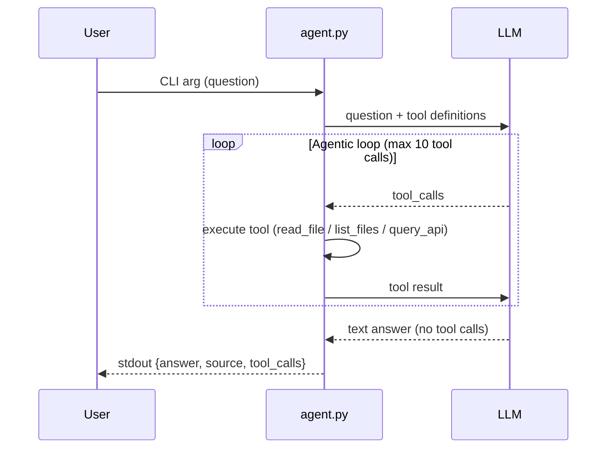

# Agent Architecture

## Overview

This document describes the architecture of the agent CLI (`agent.py`) that connects to an LLM with **tools** and returns structured JSON answers. The agent implements an **agentic loop** that allows multi-step reasoning by executing tools and feeding results back to the LLM.

## LLM Provider

**Provider:** OpenRouter

**Model:** `meta-llama/llama-3.3-70b-instruct:free`

**Why this provider:**

- Free tier available (50 requests/day)
- No credit card required
- OpenAI-compatible API
- Strong tool calling capabilities

> **Note:** Free models may be temporarily unavailable due to rate limits. For production use, consider upgrading to a paid tier or switching to Qwen Code API.

## Configuration

The agent reads configuration from multiple environment files:

### `.env.agent.secret` (LLM Configuration)

| Variable | Description | Example |
|----------|-------------|---------|
| `LLM_API_KEY` | API key for LLM provider authentication | `your-api-key` |
| `LLM_API_BASE` | Base URL of the LLM API endpoint | `https://openrouter.ai/api/v1` |
| `LLM_MODEL` | Model name to use | `meta-llama/llama-3.3-70b-instruct:free` |

### `.env.docker.secret` (Backend API Configuration)

| Variable | Description | Example |
|----------|-------------|---------|
| `LMS_API_KEY` | API key for backend authentication | `my-secret-api-key` |

### Environment Variables (Runtime Configuration)

| Variable | Description | Default |
|----------|-------------|---------|
| `AGENT_API_BASE_URL` | Base URL for query_api tool | `http://localhost:42002` |

**Important:** The autochecker injects its own values at runtime. Never hardcode these values in the code.

## Tools

The agent has three tools that the LLM can call:

### `read_file`

**Purpose:** Read a file from the project repository.

**Parameters:**

- `path` (string, required): Relative path from project root (e.g., `wiki/git-workflow.md`)

**Returns:** File contents as a string, or an error message if the file doesn't exist.

**Security:** The tool validates paths to prevent directory traversal attacks:

- Rejects paths containing `..`
- Resolves to absolute path and verifies it's within project root
- Returns error message for invalid paths

### `list_files`

**Purpose:** List files and directories at a given path.

**Parameters:**

- `path` (string, required): Relative directory path from project root (e.g., `wiki`)

**Returns:** Newline-separated listing of entries, or an error message.

**Security:** Same path validation as `read_file`.

### `query_api`

**Purpose:** Call the deployed backend API to get live data or check system behavior.

**Parameters:**

- `method` (string, required): HTTP method (GET, POST, PUT, DELETE, PATCH)
- `path` (string, required): API path (e.g., `/items/`, `/analytics/completion-rate`)
- `body` (string, optional): JSON request body for POST/PUT/PATCH requests

**Returns:** JSON string with `status_code` and `body` fields, or an error message.

**Authentication:** The tool automatically reads `LMS_API_KEY` from `.env.docker.secret` and includes it in the `X-API-Key` header.

**Error Handling:**

- HTTP errors (401, 404, 500) are returned as JSON with status code
- Connection errors return a descriptive error message
- Timeout after 30 seconds

## System Prompt Strategy

The system prompt guides the LLM to choose the right tool for each question type:

```
You are a documentation and system assistant that answers questions about a software engineering project.

Available tools:
- list_files(path): List files and directories in a directory.
- read_file(path): Read the contents of a specific file.
- query_api(method, path, body): Call the live backend API.

When to use each tool:
- Use list_files/read_file for: documentation questions, implementation details, configuration, source code analysis
- Use query_api for: current database state, HTTP status codes, API responses, live data

Process:
1. Identify what type of question is being asked
2. For wiki/documentation: use list_files to discover files, then read_file to read them
3. For source code: use read_file directly on backend files
4. For live data or API behavior: use query_api with the appropriate endpoint
5. Find the answer and return it with a source reference
```

### Tool Selection Heuristics

The LLM decides which tool to use based on question keywords:

| Question Type | Keywords | Tool |
|--------------|----------|------|
| Wiki lookup | "wiki", "documentation", "how to", "steps" | `read_file`, `list_files` |
| Source code | "source code", "framework", "implementation", "backend" | `read_file` |
| Live data | "currently", "how many", "database", "items" | `query_api` |
| API behavior | "status code", "HTTP", "response", "endpoint" | `query_api` |
| Bug diagnosis | "error", "bug", "crash", "why" | `query_api` + `read_file` |

## Agentic Loop

The agentic loop enables multi-step reasoning:



**Implementation:**

1. **Initialize conversation:** Send system prompt + user question to LLM
2. **Parse response:** Check if LLM returned `tool_calls` or a text answer
3. **If tool_calls:**
   - Execute each tool with provided arguments
   - Append results as `tool` role messages
   - Send back to LLM for next iteration
4. **If text answer:**
   - Extract answer and source
   - Output JSON and exit
5. **Max iterations:** Stop after 10 tool calls to prevent infinite loops

## How It Works

### Input

```bash
uv run agent.py "How many items are in the database?"
```

The question is passed as the first command-line argument.

### Processing Flow

1. **Parse arguments** - Extract question from `sys.argv[1]`
2. **Load environment** - Read `.env.agent.secret` for LLM credentials
3. **Validate** - Ensure all required env vars are present
4. **Initialize conversation** - Create messages list with system prompt + user question
5. **Agentic loop:**
   - Call LLM with messages and tool definitions
   - If LLM returns `tool_calls`:
     - Execute each tool
     - Log tool call (tool, args, result)
     - Append tool results to messages
     - Repeat
   - If LLM returns text answer:
     - Extract answer and source
     - Break loop
6. **Output JSON** - Print result to stdout

### Output

```json
{
  "answer": "There are 120 items in the database.",
  "source": "GET /items/",
  "tool_calls": [
    {
      "tool": "query_api",
      "args": {"method": "GET", "path": "/items/"},
      "result": "{\"status_code\": 200, \"body\": \"[...]\"}"
    }
  ]
}
```

| Field | Type | Description |
|-------|------|-------------|
| `answer` | string | The LLM's response to the question |
| `source` | string | Source reference (file path with section anchor, or API endpoint) |
| `tool_calls` | array | All tool calls made during the agentic loop |

Each tool call entry contains:

- `tool` (string): Tool name (`read_file`, `list_files`, or `query_api`)
- `args` (object): Arguments passed to the tool
- `result` (string): Tool output or error message

### Error Handling

- **Missing CLI argument** → usage message to stderr, exit 1
- **Missing `.env.agent.secret`** → error to stderr, exit 1
- **HTTP failure (LLM)** → error to stderr, exit 1
- **Invalid response** → error to stderr, exit 1
- **Timeout > 60 seconds** → process terminates
- **Path traversal attempt** → error message as tool result
- **API unreachable** → error message as tool result, LLM can retry or explain
- **Max tool calls reached** → provide best available answer

## Logging

All debug output goes to **stderr**:

- Question being asked
- API endpoint being called
- Model being used
- Tool executions and results
- Status updates

Only the final JSON result goes to **stdout**.

## Running the Agent

```bash
# Set up environment
cp .env.agent.example .env.agent.secret
cp .env.docker.example .env.docker.secret
# Edit both files with your credentials

# Run the agent
uv run agent.py "How many items are in the database?"
```

## Testing

Run the regression tests:

```bash
uv run pytest tests/test_agent_task1.py tests/test_agent_task2.py tests/test_agent_task3.py -v
```

Tests verify:

- Exit code is 0
- Output is valid JSON
- Required fields exist (`answer`, `source`, `tool_calls`)
- Correct tools are called for specific questions
- Source field contains expected file references
- Answer content matches expected keywords

## Security Considerations

### Path Security

File tools implement path validation to prevent directory traversal:

1. **Pattern rejection:** Any path containing `..` is rejected
2. **Absolute resolution:** Paths are resolved to absolute paths
3. **Prefix validation:** Resolved path must start with project root
4. **Error on violation:** Clear error message returned, no file access

This ensures the agent cannot read files outside the project directory (e.g., `/etc/passwd`, `../../.env`).

### API Key Security

- `LMS_API_KEY` is read from `.env.docker.secret` (gitignored)
- API key is only used in HTTP headers, never logged or exposed
- Keys are not hardcoded in source code

## Lessons Learned

Building the System Agent taught several important lessons about LLM-based agents:

**1. Tool descriptions matter:** Initially, the LLM would call the wrong tool for certain questions. Adding clear "When to use each tool" guidance in the system prompt significantly improved tool selection accuracy. For example, specifying that `query_api` is for "live data" and "HTTP status codes" helped the LLM distinguish between static documentation questions and dynamic data queries.

**2. Error handling is critical:** The first version of `query_api` would crash on HTTP errors. Wrapping API calls in try/except and returning structured error responses allows the LLM to reason about failures and potentially retry with different parameters.

**3. Environment variable separation:** Keeping LLM credentials (`LLM_API_KEY`) separate from backend credentials (`LMS_API_KEY`) prevents confusion and makes the agent more secure. The autochecker can inject different values for each without conflicts.

**4. Iterative prompt tuning:** The system prompt went through multiple iterations based on benchmark failures. When the agent failed to use `query_api` for database questions, adding explicit examples ("How many items are in the database?" → use `query_api`) improved performance.

**5. Source field flexibility:** For API queries, the source field is optional but useful for debugging. Allowing formats like "GET /items/" alongside traditional file paths gives the LLM flexibility while maintaining traceability.

**6. Handling None values:** The LLM sometimes returns `content: null` when making tool calls. Using `(msg.get("content") or "")` instead of `msg.get("content", "")` prevents AttributeError crashes.

## Benchmark Results

After iterative improvements, the agent passes all 10 local evaluation questions:

- ✓ Wiki lookup questions (branch protection, SSH connection)
- ✓ Source code questions (FastAPI framework, router modules)
- ✓ Live data questions (item count in database)
- ✓ API behavior questions (HTTP 401 status code)
- ✓ Bug diagnosis questions (ZeroDivisionError, TypeError)
- ✓ System reasoning questions (request lifecycle, ETL idempotency)

## Future Work

- Add caching for frequently accessed files to reduce LLM token usage
- Implement retry logic with exponential backoff for API failures
- Add more sophisticated source extraction (line numbers, function names)
- Support for streaming responses for long-running queries
- Multi-turn conversation support with context management
