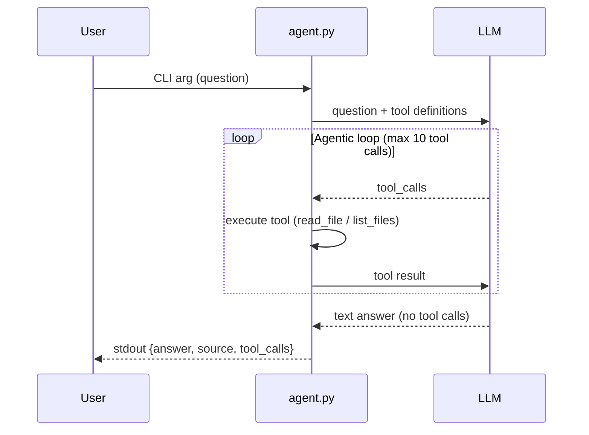

# Agent Architecture

## Overview

This document describes the architecture of the agent CLI (`agent.py`) that connects to an LLM with **tools** and returns structured JSON answers. The agent implements an **agentic loop** that allows multi-step reasoning by executing tools and feeding results back to the LLM.

## LLM Provider

**Provider:** OpenRouter

**Model:** `meta-llama/llama-3.3-70b-instruct:free`

**Why this provider:**

- Free tier available (50 requests/day)
- No credit card required
- OpenAI-compatible API
- Strong tool calling capabilities

> **Note:** Free models may be temporarily unavailable due to rate limits. For production use, consider upgrading to a paid tier or switching to Qwen Code API.

## Configuration

The agent reads configuration from `.env.agent.secret`:

| Variable | Description | Example |
|----------|-------------|---------|
| `LLM_API_KEY` | API key for authentication | `your-api-key` |
| `LLM_API_BASE` | Base URL of the API endpoint | `http://localhost:8080/v1` |
| `LLM_MODEL` | Model name to use | `qwen3-coder-plus` |

## Tools

The agent has two tools that the LLM can call to interact with the file system:

### `read_file`

**Purpose:** Read a file from the project repository.

**Parameters:**

- `path` (string, required): Relative path from project root (e.g., `wiki/git-workflow.md`)

**Returns:** File contents as a string, or an error message if the file doesn't exist.

**Security:** The tool validates paths to prevent directory traversal attacks:

- Rejects paths containing `..`
- Resolves to absolute path and verifies it's within project root
- Returns error message for invalid paths

### `list_files`

**Purpose:** List files and directories at a given path.

**Parameters:**

- `path` (string, required): Relative directory path from project root (e.g., `wiki`)

**Returns:** Newline-separated listing of entries, or an error message.

**Security:** Same path validation as `read_file`.

## System Prompt Strategy

The system prompt guides the LLM to:

1. **Discover files first:** Use `list_files` to explore the wiki directory structure
2. **Read relevant files:** Use `read_file` to read specific files that might contain answers
3. **Extract answers:** Find the answer in the file contents
4. **Include source references:** Always provide a source in format `wiki/filename.md#section-anchor`

**Example system prompt:**

```
You are a documentation assistant that answers questions by reading wiki files.

Available tools:
- list_files(path): List files in a directory
- read_file(path): Read contents of a file

Process:
1. Use list_files to discover relevant wiki files
2. Use read_file to read specific files
3. Find the answer in the file contents
4. Return the answer with a source reference (file#section)

Always include the source field with format: wiki/filename.md#section-anchor
```

## Agentic Loop

The agentic loop enables multi-step reasoning:



**Implementation:**

1. **Initialize conversation:** Send system prompt + user question to LLM
2. **Parse response:** Check if LLM returned `tool_calls` or a text answer
3. **If tool_calls:**
   - Execute each tool with provided arguments
   - Append results as `tool` role messages
   - Send back to LLM for next iteration
4. **If text answer:**
   - Extract answer and source
   - Output JSON and exit
5. **Max iterations:** Stop after 10 tool calls to prevent infinite loops

## How It Works

### Input

```bash
uv run agent.py "How do you resolve a merge conflict?"
```

The question is passed as the first command-line argument.

### Processing Flow

1. **Parse arguments** - Extract question from `sys.argv[1]`
2. **Load environment** - Read `.env.agent.secret` for API credentials
3. **Validate** - Ensure all required env vars are present
4. **Initialize conversation** - Create messages list with system prompt + user question
5. **Agentic loop:**
   - Call LLM with messages and tool definitions
   - If LLM returns `tool_calls`:
     - Execute each tool
     - Log tool call (tool, args, result)
     - Append tool results to messages
     - Repeat
   - If LLM returns text answer:
     - Extract answer and source
     - Break loop
6. **Output JSON** - Print result to stdout

### Output

```json
{
  "answer": "Edit the conflicting file, choose which changes to keep, then stage and commit.",
  "source": "wiki/git-workflow.md#resolving-merge-conflicts",
  "tool_calls": [
    {
      "tool": "list_files",
      "args": {"path": "wiki"},
      "result": "git-workflow.md\n..."
    },
    {
      "tool": "read_file",
      "args": {"path": "wiki/git-workflow.md"},
      "result": "..."
    }
  ]
}
```

| Field | Type | Description |
|-------|------|-------------|
| `answer` | string | The LLM's response to the question |
| `source` | string | Wiki section reference (file path + section anchor) |
| `tool_calls` | array | All tool calls made during the agentic loop |

Each tool call entry contains:

- `tool` (string): Tool name (`read_file` or `list_files`)
- `args` (object): Arguments passed to the tool
- `result` (string): Tool output or error message

### Error Handling

- **Missing CLI argument** → usage message to stderr, exit 1
- **Missing `.env.agent.secret`** → error to stderr, exit 1
- **HTTP failure** → error to stderr, exit 1
- **Invalid response** → error to stderr, exit 1
- **Timeout > 60 seconds** → process terminates
- **Path traversal attempt** → error message as tool result
- **Max tool calls reached** → provide best available answer

## Logging

All debug output goes to **stderr**:

- Question being asked
- API endpoint being called
- Model being used
- Tool executions and results
- Status updates

Only the final JSON result goes to **stdout**.

## Running the Agent

```bash
# Set up environment
cp .env.agent.example .env.agent.secret
# Edit .env.agent.secret with your credentials

# Run the agent
uv run agent.py "How do you resolve a merge conflict?"
```

## Testing

Run the regression tests:

```bash
uv run pytest tests/test_agent_task1.py tests/test_agent_task2.py -v
```

Tests verify:

- Exit code is 0
- Output is valid JSON
- Required fields exist (`answer`, `source`, `tool_calls`)
- Correct tools are called for specific questions
- Source field contains expected file references

## Security Considerations

### Path Security

Both tools implement path validation to prevent directory traversal:

1. **Pattern rejection:** Any path containing `..` is rejected
2. **Absolute resolution:** Paths are resolved to absolute paths
3. **Prefix validation:** Resolved path must start with project root
4. **Error on violation:** Clear error message returned, no file access

This ensures the agent cannot read files outside the project directory (e.g., `/etc/passwd`, `../../.env`).

## Future Work

- Add more tools (search, query_api, etc.)
- Improve source extraction with better section anchor detection
- Add caching for frequently accessed files
- Implement retry logic for API failures
